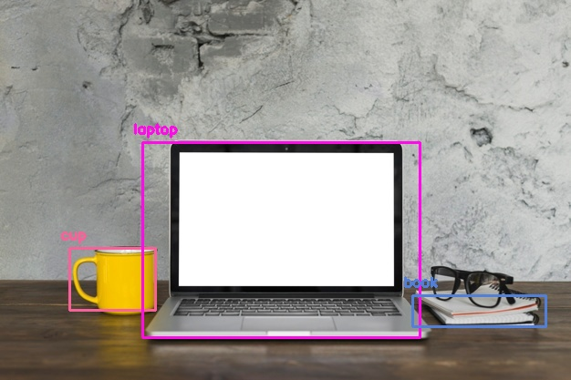
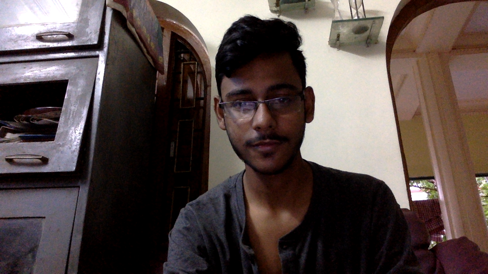

# Object detection using deep learning with OpenCV and Python 

OpenCV `dnn` module supports running inference on pre-trained deep learning models from popular frameworks like Caffe, Torch and TensorFlow. 

When it comes to object detection, popular detection frameworks are
 * YOLO
 * SSD
 * Faster R-CNN
 
 Support for running YOLO/DarkNet has been added to OpenCV dnn module recently. 
 
 ## Dependencies
  * opencv
  * numpy
  
`pip install numpy opencv-python`

 ## YOLO (You Only Look Once)
 
 Download the pre-trained YOLO v3 weights file (yolov3.weights) from this [link](https://pjreddie.com/media/files/yolov3.weights) and place it in the current directory .
 
 Note: Without 'yolov3.weights', the program won't work. Size = 248 MB
 
 Provided all the files are in the current directory, below command will apply object detection on the input image `test.jpg`.
 
 `$ python yolo_opencv.py --image test.jpg --config yolov3.cfg --weights yolov3.weights --classes yolov3.txt`
 
 
 **Command format** 
 
 _$ python yolo_opencv.py --image /path/to/input/image --config /path/to/config/file --weights /path/to/weights/file --classes /path/to/classes/file_
 
 
 ### sample output :
 
 
 ### sample output :
 
 
 ## Capture
 
 This repository also contains a python file, 'capt.py' to capture images using the web-cam. Once, the image is captured, it is saved in the same directory and can be used as a subject.
 
 ### sample output :
 
 
